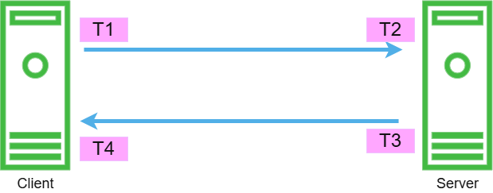

# Architecture

When you start up ``latency-monitor`` for the very first time, without any targets, it creates a pair of TCP and UDP 
servers ready to listen to connections, that'll exchange probes. Going forward, we'll call this _server mode_.

Once you start adding targets that you want to monitor, there will be additional sub-processes being spawned that create 
TCP and / or UDP clients connecting to ``latency-monitor`` instance assumed to be running on the remote end, i.e., on 
the target. We'll call that _client mode_.

In other words, the client will always require a TCP / UDP server on the target readily available for connections; it 
can't work in standalone mode.

In order to explain why this is necessary, consider the following diagram:

<figure markdown="span">
  { width="600" }
  <figcaption>Latency Monitor timestamps</figcaption>
</figure>

The client connects to the server and sends a packet containing the nanosecond timestamp *T1* (together with other bits of
information, that will be covered later). Once the server receives the packet, extracts this timestamp, and it computes 
the OWD (one-way delay) as the difference between the current time *T2* (in nanoseconds) and the timestamp received.
Together with the other bits of data received, the server computes the OWD metrics for this connection and places it on 
a multiprocessing queue.

Unless RTT (round-trip time) is intentionally disabled, the server sends back to the client a packet containing the
timestamp that the client receives and computes the RTT as being the time it took for this back-and-forth dance. The 
client therefore computes the RTT metrics and puts them on the multiprocessing queue.

TL;DR: for every path you need the ``latency-monitor`` service running on both ends & who receives the probe ships the 
metrics.

As monitoring happens both ways, and you'll likely need the OWD from A to B, as well as from B to A, ``latency-monitor`` 
can concomitantly be both a server and a client (if you define some targets). Since every instance is independent, 
you'll want to configure the same metrics backend on every node, so they all send the OWD and RTT results to the same 
system.

## Subprocesses

There's a separate subprocess for the following:

- TCP server
- UDP server
- TCP targets
- UDP targets
- TCP Latency poller
- Metrics backend worker

Of course, depending on the configuration settings you use, some processes may not be started up. For example, if you 
execute using the ``--no-tcp`` flag, then any TCP related processes won't be started.

On the server side, every new connection is being handled in its own thread, and similarly, on the client side, every 
connection with the server (i.e., towards a target) spawns a separate thread. If the TCP connection is dropped on either
side, then the thread or subprocess is being re-spawned trying to re-establish the session.

## The message format

The messages exchanged between the clients and the servers have the following format:

``<SEQ>|<source>|<timestamp>|<tags>|<padding>``, where:

- ``SEQ``: the packet sequence counter, incremented on every packet sent. If the received SEQ differs from the expected
  SEQ, then the packet is considered lost. When 10 (by default, customisable) consecutive packets are flagged as lost,
  then the TCP connection is considered unusable, and it'll attempt to re-connect.
- ``source``: the label (or IP) of who sent this packet. This is required on the receiving side to build the tags /
  labels for the metrics.
- ``timestamp``: numeric value, the nanosecond timestamp when the packet was sent.
- ``tags``: the list of tags, as configured for the probe (if any).
- ``padding``: 0-stuffed padding to match the desired payload size. When the ``size`` is not configured, then the 
  padding will be empty.

## The metrics queue

Every ``latency-monitor`` instance has its own internal queue where clients and servers put metrics as they're 
computed. Once a metric is available, it's placed on the queue, and the metrics backend will collect (and potentially
aggregate) them without blocking the other processes.
